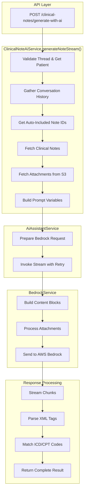
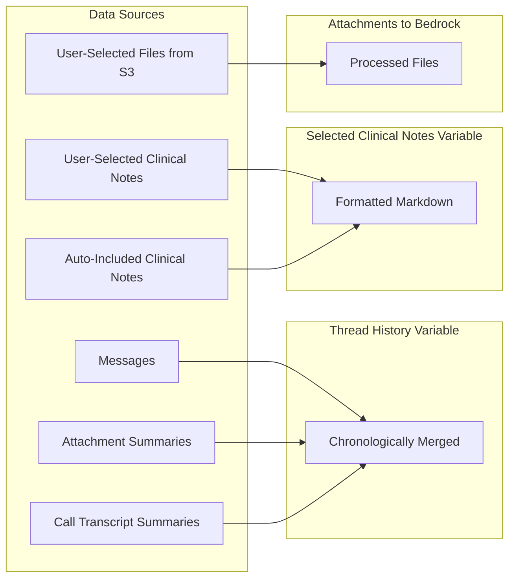
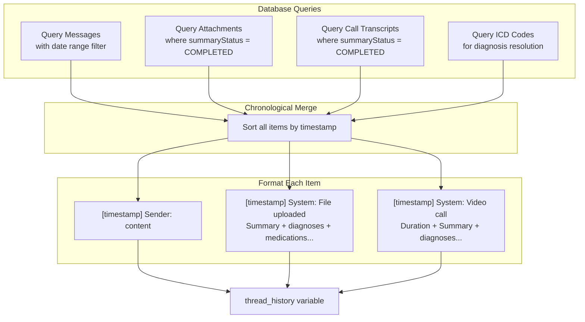
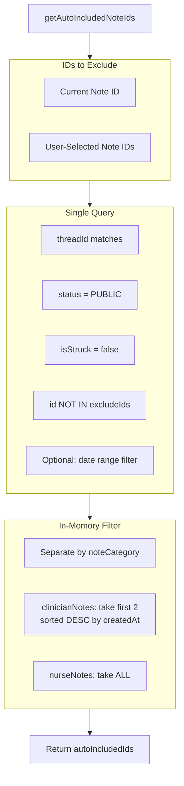
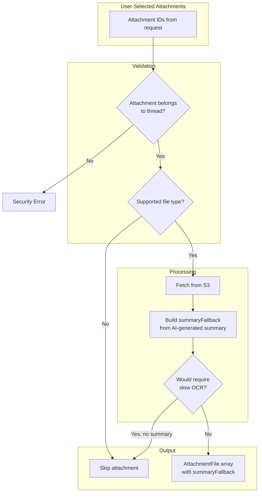
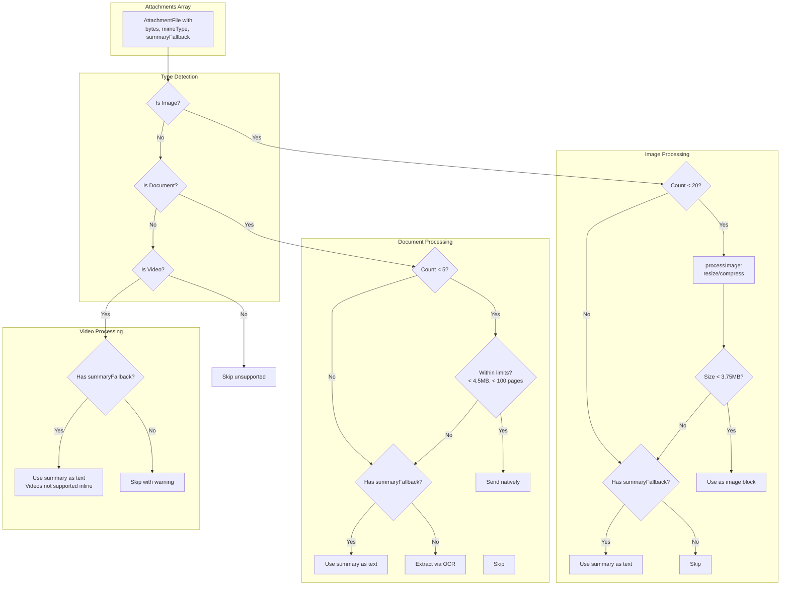
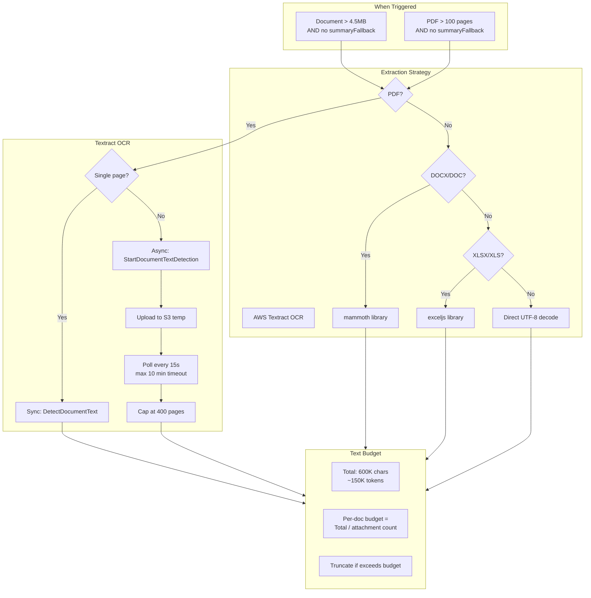
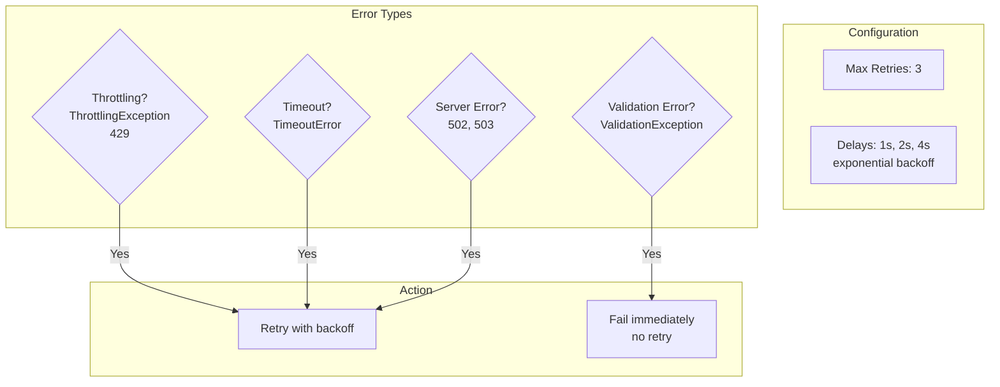
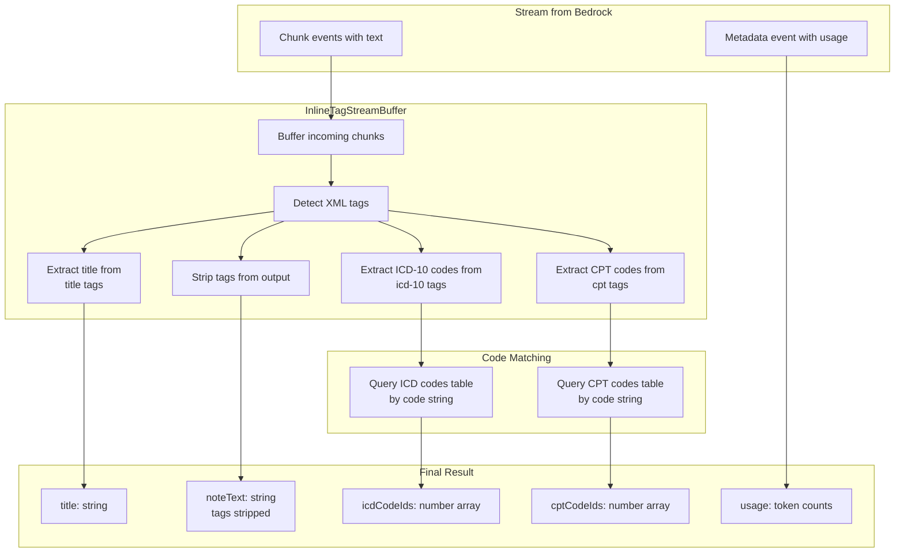
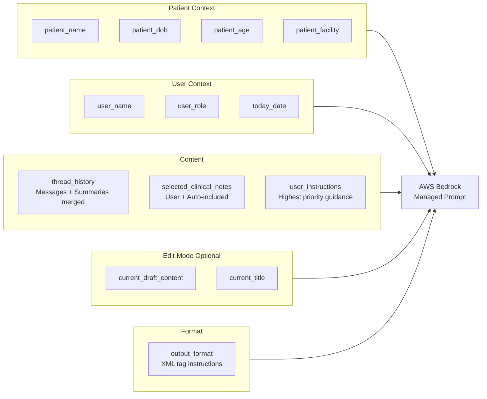

# Clinical Note AI Generation - Data Flow

## High-Level Overview

## Data Sources Gathered

## Conversation History Gathering

## Auto-Included Clinical Notes Logic

## Attachment Processing Flow

## Bedrock Content Block Building

## Bedrock Limits

| Resource | Limit | Fallback Strategy |
|----------|-------|-------------------|
| Images per request | 20 | Use summaryFallback as text, or skip |
| Image max size | 3.75MB | Compress (85% → 70% → 50% → 30%), then fallback |
| Image max dimension | 8000px | Resize proportionally |
| Documents per request | 5 | Use summaryFallback as text, or skip |
| Document max size | 4.5MB | Use summaryFallback, or extract via OCR |
| PDF max pages | 100 | Use summaryFallback, or extract via OCR |
| Videos per request | 1 | Always use summaryFallback (not supported inline) |
| Video max size (S3) | 1GB | N/A (use summary) |
| Video max duration | 30s | N/A (use summary) |

## Document OCR Extraction Flow

## Retry Strategy

## Response Streaming & Parsing

## Prompt Variables Summary

## Fallback Strategy Summary

| Scenario | Primary Strategy | Fallback | Last Resort |
|----------|------------------|----------|-------------|
| Image > 3.75MB | Compress progressively | Use summaryFallback | Skip |
| Image count > 20 | - | Use summaryFallback | Skip |
| Document > 4.5MB | Use summaryFallback | OCR extraction | Skip |
| Document > 100 pages | Use summaryFallback | OCR extraction | Skip |
| Document count > 5 | - | Use summaryFallback | Skip |
| Video attachment | Use summaryFallback | - | Skip with warning |
| Unsupported type | - | - | Skip |
| OCR timeout (10min) | - | - | Fail gracefully |
| S3 fetch fails | - | - | Skip that attachment |
| Bedrock throttling | Retry 3x with backoff | - | Return error |
| Bedrock validation | - | - | Return error immediately |
